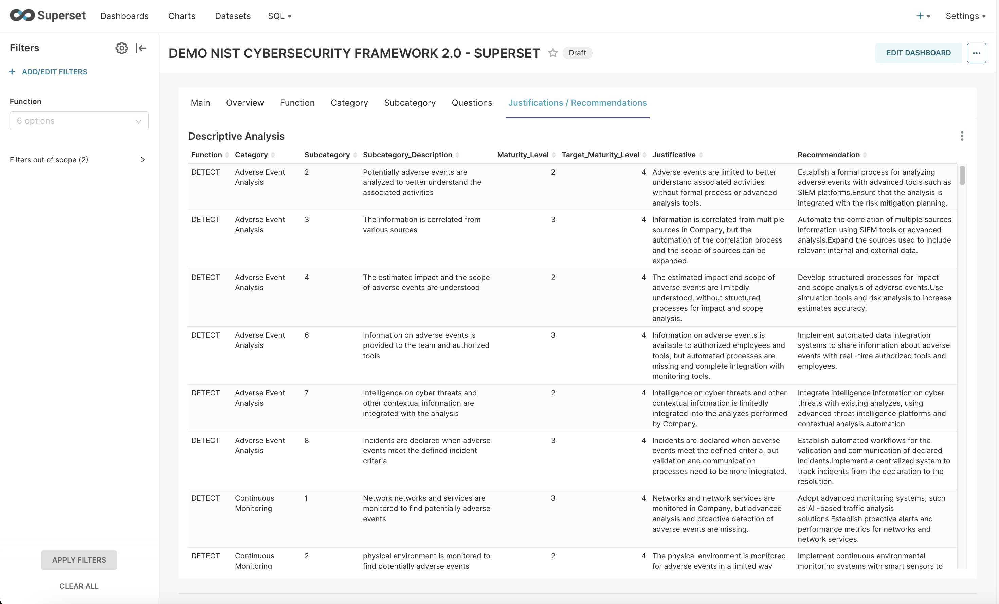

# NIST CSF 2.0 Dashboard with Mock Data

This repository provides a **dashboard** for [Apache Superset](https://superset.apache.org/) along with a SQLite database containing mock data based on the **NIST CSF 2.0** framework. Additionally, it includes a Python script for editing and managing maturity levels, reviewers, justifications, and recommendations for each analyzed item.

---

## Repository Contents

1. **`dashboard_export_20241216T210210.zip`**  
   A Superset export file containing the pre-configured dashboard.

2. **`DEMO_NIST_CSF_2_0.db`**  
   A SQLite database with mock structured data.

3. **`sqliteedit_en.py`**  
   A Python script built with Streamlit to edit maturity levels (current and target), reviewers, justifications, and recommendations for each item in the database.

4. **Screenshots**  
   Screenshots of the Superset dashboard.

---

## Requirements

Ensure you have the following installed:

1. **Apache Superset**  
   Refer to the [official documentation](https://superset.apache.org/docs/installation/installing-superset) for installation instructions.

2. **Python** (recommended >= 3.8).  
   Install the required Python modules:
   ```bash
   pip install streamlit sqlite3 pandas
   ```

3. **SQLite database support**.

---

## How to Use

### 1. Configure the Superset Environment

Ensure Superset is running locally or on a server.

### 2. Import the Mock Database

1. Copy the `DEMO_NIST_CSF_2_0.db` file to an accessible folder.
2. Set up the database connection in Superset:
   - Go to **Database Connections** and add a new database.
   - Use the following connection string:  
     ```
     sqlite:////<absolute_path_to_file>/DEMO_NIST_CSF_2_0.db
     ```

### 3. Import the Dashboard

1. Open the Superset web interface.
2. Navigate to **Settings > Import Dashboards**.
3. Upload the `dashboard_export_20241216T210210.zip` file.

### 4. Use the SQLite Editor

To manage or edit data, use the `sqliteedit_en.py` script:

1. Install Streamlit and other required modules if not already installed:
   ```bash
   pip install streamlit sqlite3 pandas
   ```
2. Run the script:
   ```bash
   streamlit run sqliteedit_en.py
   ```
3. In the Streamlit interface, you can:
   - Update **Status** fields.
   - Modify **Maturity Level** and **Target Maturity Level**.
   - Add or change **Reviewer**, **Justificative**, and **Recommendation**.

### 5. View and Update Records

After editing with the SQLite editor, the changes will be reflected in Superset when the database is reloaded.

---

## Screenshots

### 1. Main Dashboard

The **Main** tab introduces the NIST CSF 2.0 and includes a **Treemap** to showcase the major functions and categories.


---

### 2. Descriptive Analysis

The **Justifications / Recommendations** tab provides a detailed breakdown of maturity levels, justifications, and recommendations for each category and subcategory.


---

### 3. Maturity of Subcategories

The **Subcategory** tab compares the **Current Maturity Level** to the **Target Maturity Level** using a bar chart and displays a **Category to Subcategory Graph**.


---

### 4. Overview of Maturity Levels

The **Overview** tab summarizes:
- The overall maturity level.
- Maturity by function.
- Subcategory distribution using visualizations like gauge charts, tables, and pie charts.



---

## Database Fields

The SQLite database includes the following relevant fields:
- **Status**: The current status of the analyzed item.
- **Maturity_Level**: The current maturity level.
- **Target_Maturity_Level**: The desired maturity level.
- **Reviewer**: The name of the reviewer.
- **Justificative**: Justification for the maturity level or status.
- **Recommendation**: Recommendations for improvement.
- **Creation_Date**: Timestamp of the last update.

---

## Contact

For questions or suggestions, feel free to reach out to the repository maintainer.

---
